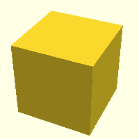

# fusion360-template

## :crystal_ball: STL files

| | |
|---|---|
| [Cube.stl](./stl/cube.stl)| | 

## :triangular_ruler: Fusion 360 files

---
The contents of this readme were automatically generated from [:notebook: this template](https://github.com/spuder/fusion360-template) using [ :octocat: github actions](https://github.com/spuder/fusion360-template/actions) 